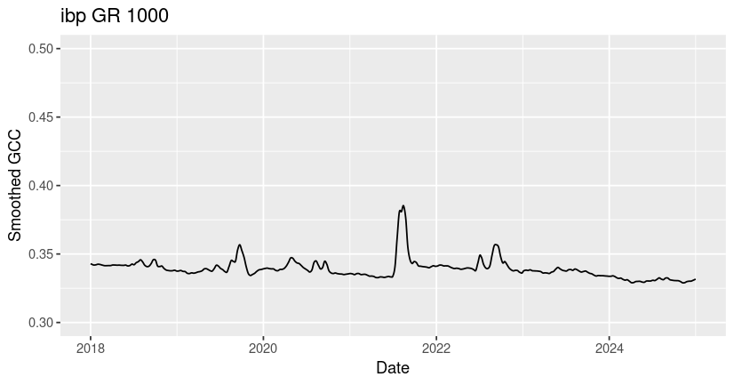
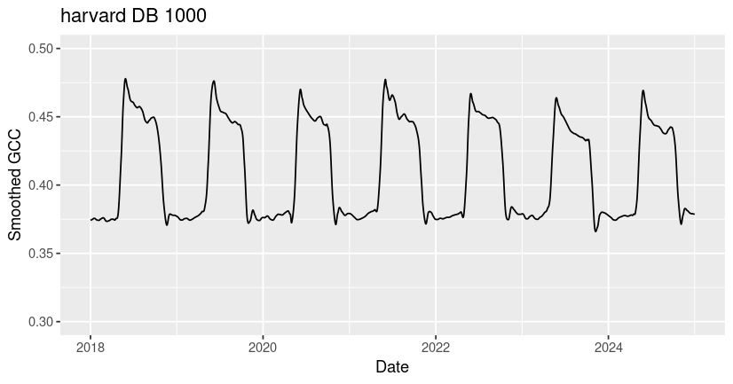
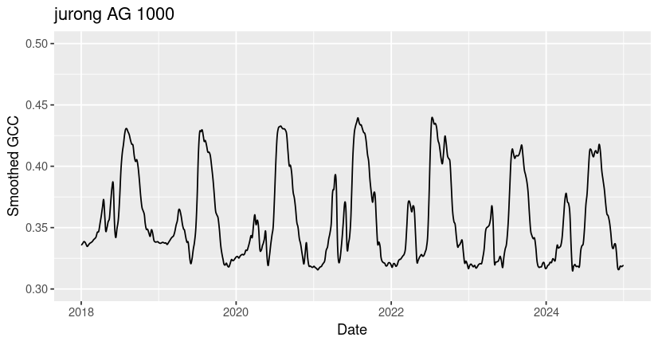
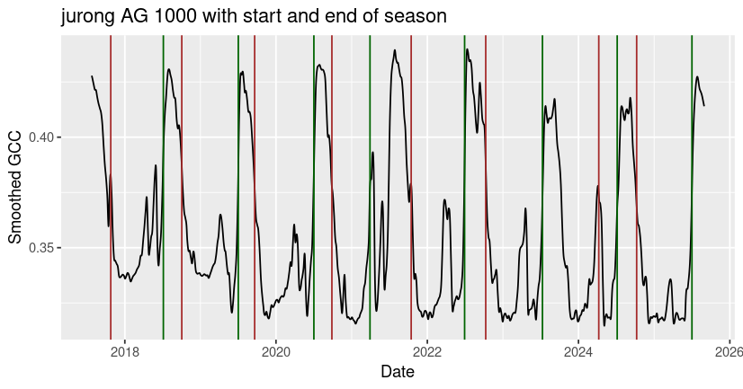
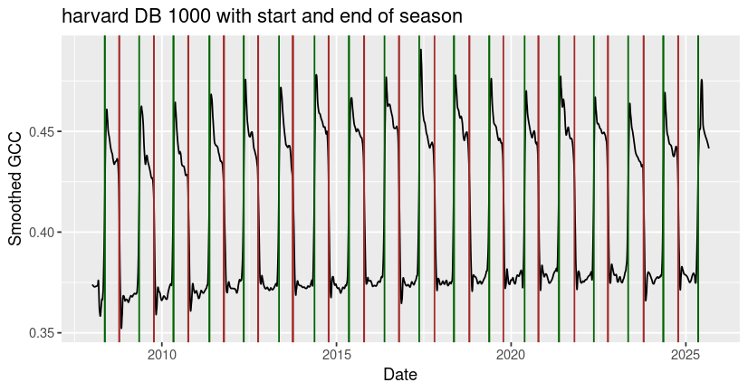

**Last Update:** 3 July 2025 <br /> **Download RMarkdown**: [ImportingPhenocam.Rmd](https://geospatial.101workbook.org/tutorials/ImportingPhenocam.Rmd)

## Overview

The PhenoCam Network uses digital camera imagery to track vegetation seasonality (also called phenology) in a wide range of ecosystems around the world. Cameras that are a part of this network collect images at half-hour intervals every day between sunrise and sunset.

Although it is possible to visually assess the timing of key changes (e.g. leaf emergence) by looking at the images, most larger-scale analyses of vegetation phenology rely on our ability to calculate canopy greenness from these images, and use changes in canopy greenness over time to estimate phenology.

This tutorial covers the R package `phenocamr` for downloading near-surface canopy greenness data and estimating seasonal transition dates for sites in the PhenoCam Network. The content of this tutorial is modified from the [vignette](https://bluegreen-labs.github.io/phenocamr/articles/phenocamr-vignette.html) for the `phenocamr` package.

This package is also described in the following paper: Hufkens, K., Basler, J., Milliman, T. Melaas, E., Richardson, A. 2018. [An integrated phenology modelling framework in R: Phenology modelling with phenor](https://doi.org/10.1111/2041-210X.12970). The PhenoCam standard data products, which we will download as a part of this tutorial, are described in detail in the following paper: Richardson, A., Hufkens, K., Milliman, T. et al. 2018. [Tracking vegetation phenology across diverse North American biomes using PhenoCam imagery](https://doi.org/10.1038/sdata.2018.28).

*Language:* `R`

*Primary Libraries/Packages:*

| Name      | Description                                                      | Link                                          |
|:----------|:-----------------------------------------------------------------|:----------------------------------------------|
| phenocamr | R interface to PhenoCam Web Services                             | <https://github.com/bluegreen-labs/phenocamr> |
| dplyr     | A Grammar of Data Manipulation                                   | <https://https://dplyr.tidyverse.org/>        |
| ggplot2   | Create Elegant Data Visualizations Using the Grammar of Graphics | <https://ggplot2.tidyverse.org/>              |

## Nomenclature

-   *PhenoCam:* A digital camera mounted over a vegetation canopy that collects red, green, and blue (RGB) images of the canopy multiple times per day.
-   *GCC:* The green chromatic coordinate (GCC) is a measure of canopy greenness. GCC is calculated by dividing the green channel brightness by the total brightness across the red, green, and blue channels.
-   *ROI:* Region of interest within an image or series of images, over which calculations (like GCC) are performed.
-   *Phenology:* The study of periodic events in biological life cycles and how these are influenced by seasonal and interannual variations in climate. In plants, examples include the date of leaf emergence near the start of the growing season and the date of leaf browning near the end of the growing season.
-   *Growing season:* A full cycle of vegetation productivity, from dormancy to active growth, senescence, and then back to dormancy.
-   *Start of season (SOS):* The start of the "greenness rising" stage for a full cycle of vegetation activity. Also referred to as "green-up".
-   *End of season (EOS):* The end of the "greenness falling" stage for a full cycle of vegetation activity.

## Data Details

-   Data: PhenoCam Network GCC
-   Link: <https://phenocam.nau.edu/webcam/>
-   Other Details: The PhenoCam Network is a cooperative continental-scale phenological observatory that uses imagery from networked digital cameras to track vegetation phenology in a diverse range of ecosystems across North America and around the World. PhenoCam was established in 2008 and currently includes images of over 700 sites.

## Analysis Steps

-   Use the PhenoCam website or the built-in `list_sites` or `list_rois` functions to select PhenoCam sites of interest
-   Download PhenoCam GCC data for sites of interest
-   Read downloaded GCC time-series data using `read_phenocam`, and visualize it using `ggplot`
-   Calculate and visualize seasonal transition dates

## Step 0: Import Libraries/Packages

``` r
# phenocam data
install.packages("phenocamr")
library(phenocamr)

# working with dataframes
library(dplyr)

# visualization and plotting
library(ggplot2)
```

## Step 1: Select your phenocam sites

More than 1000 cameras provide imagery to the PhenoCam network. You can browse PhenoCam network sites on the PhenoCam website, via the [gallery](https://phenocam.nau.edu/webcam/gallery/) or the [map of sites](https://phenocam.nau.edu/webcam/network/map/). Most sites have one or more associated ROIs, which are used to create GCC or NDVI time-series data. The [full list of GCC ROIs](https://phenocam.nau.edu/webcam/roi/search/) is also available on the PhenoCam website, under the Data tab.

You can also view a full list of sites and associated metadata using the `list_sites` function in phenocamr.

``` r
# Generate a full list of phenocam sites and their metadata
phenocam_sites <- list_sites()

# View the first six entries of the site table
head(phenocam_sites)
```

```         
                site       lat       lon elev ...
1 aafcottawacfiaf14e  45.29210 -75.76640   90 ...
2 aafcottawacfiaf14n  45.29290 -75.76700   90 ...
3 aafcottawacfiaf14w  45.29210 -75.76640   90 ...
4             acadia  44.37694 -68.26083  158 ...
5       admixpasture -43.64930 172.34950   33 ...
6       adrycpasture -43.65130 172.35010   31 ...
```

Similarly, to view a list of ROIs, you can use the `list_rois` function.

``` r
# Generate a full list of phenocam ROIs and their metadata
phenocam_rois <- list_rois()

# View the first six entries of the roi table
head(phenocam_rois)
```

```         
                site       lat       lon veg_type roi_id_number ...
1 aafcottawacfiaf14e  45.29210 -75.76640       AG          1000 ...
2 aafcottawacfiaf14n  45.29290 -75.76700       AG          1000 ...
3 aafcottawacfiaf14w  45.29210 -75.76640       AG          1000 ...
4             acadia  44.37694 -68.26083       DB          1000 ...
5             acadia  44.37694 -68.26083       DB          2000 ...
6       admixpasture -43.64930 172.34950       AG          1000 ...
```

You can also filter the site or ROI list to look for cameras or ROIs with specific attributes.

``` r
# Using dplyr, filter the roi dataframe to look for ROIs with AG veg types and at least 9 years of data
filter(phenocam_rois, veg_type=="AG", site_years>=9)
```

```         
                       site      lat        lon veg_type roi_id_number ...
1              armoklahoma 36.60580  -97.48880       AG          1000  ...
2           arsmnswanlake1 45.68451  -95.79970       AG          1000  ...
3                goodwater 39.22848  -92.11936       AG          1000  ...
4                goodwater 39.22848  -92.11936       AG          1001  ...
5         harvardfarmnorth 42.52047  -72.18224       AG          1000  ...
6                 mandanh5 46.77542 -100.95109       AG          1000  ...
7                    mead3 41.17970  -96.43970       AG          1000  ...
8  NEON.D06.KONA.DP1.00042 39.11045  -96.61293       AG          1000  ...
9            rosemountnprs 44.67810  -93.07230       AG          1000  ...
10     southerngreatplains 36.60580  -97.48880       AG          1000  ...
11               uiefmaize 40.06282  -88.19613       AG          1000  ...
12          uiefmiscanthus 40.06281  -88.19843       AG          1000  ...
13         uiefswitchgrass 40.06465  -88.19606       AG          1000  ...
```

## Step 2: Download phenocam data

Once you have selected a camera or ROI that you wish to download, you can use the `download_phenocam` function to download a PhenoCam time series for that site.

The code chunk below shows the command for downloading a GCC time-series for a specific site and ROI. The function inputs are as follows:

-   site: Specifies the phenocam site for download. In this case, we are downloading data from the [harvard](https://phenocam.nau.edu/webcam/sites/harvard/) site.
-   veg_type: Specifies the vegetation type for the region of interest we are downloading. In this case, "DB" is "deciduous broadleaf".
-   roi_id: Specifies which ROI we want to download, since some cameras have more than one. In this case, we are downloading harvard ROI [DB_1000](https://phenocam.nau.edu/webcam/roi/harvard/DB_1000/).
-   frequency: Specifies the frequency of measurements. The default value of frequency is 3, meaning that the function will return GCC values aggregated over a 3-day moving window. You can also set frequency = 1 for daily data, but these data may be more noisy.
-   outlier_detection: Specifies whether or not you want to apply the outlier detection routine to the downloaded GCC data. The routine automatically detects and filters out most outlier values in the GCC time series due to contamination by snow, rain, and mist. By default, outlier_detection is set to TRUE.
-   smooth: Specifies whether or not you want to automatically smooth the data. By default, smooth is set to TRUE. Smoothed data are returned at a 1-day frequency, even if the data are initially downloaded at a 3-day frequency.
-   out_dir: Specifies the output directory for the downloaded phenocam GCC. In this case, we are using "\~" to download data into our home directory. The default output directory is tempdir().

``` r
# Download data for a single ROI for a single deciduous forest site (harvard)
download_phenocam(site = "harvard$",
                  veg_type = "DB",
                  roi_id = "1000",
                  frequency = 3,
                  outlier_detection = TRUE,
                  smooth = TRUE,
                  out_dir = "~")
```

If you don't specify veg_type or roi_id in your function call, `download_phenocam` will download phenocam GCC for *all* existing ROIs for a particular site. The code chunk below will download phenocam GCC for all seven ROIs at the [ibp](https://phenocam.nau.edu/webcam/sites/ibp/) site, which includes two GR (grass) ROIs, four SH (shrub) ROIs, and one XX (landscape) ROI.

Because frequency, outlier_detection, and smooth are not specified, the function will use the default values for these variables (frequency = 3, outlier_detection = TRUE, smooth = TRUE).

``` r
# Download data for all ROIs for a single site (ibp)
download_phenocam(site = "ibp$",
                  out_dir = "~")
```

You may notice that both of the above calls to `download_phenocam` specify the site with a '\$' at the end of the name. This is intentional! If you fail to include the '\$', the function will download GCC for *all* phenocams with a site name that begins with the specified name. For example, site = "jergrassland" will download phenocam data for "jergrassland" and "jergrassland2" and site = "good" will downlaod phenocam data for "goodnow", "goodwater", and "goodwaterbau".

Finally, we will also download phenocam data for an agricultural site, [jurong](https://phenocam.nau.edu/webcam/sites/jurong/).

``` r
# Download data for an agricultural site (jurong)
download_phenocam(site = "jurong$",
                  veg_type = "AG",
                  roi_id = "1000",
                  out_dir = "~")
```

## Step 3: View GCC time-series data

Let's take a look at the data we downloaded from our harvard site. We will be reading our CSV file in as a dataframe using the `read_phenocam` function in `phenocamr` and plotting it using `ggplot`.

``` r
# Read in the ibp GR 1000 csv
ibp <- read_phenocam("~/ibp_GR_1000_3day.csv")

# View the data
print(str(ibp))
```

```         
List of 10
 $ site          : chr "ibp"
 $ veg_type      : chr "GR"
 $ roi_id        : chr "1000"
 $ frequency     : chr "3day"
 $ lat           : num 32.6
 $ lon           : num -107
 $ elev          : num 1325
 $ solar_elev_min: num 10
 $ header        : Named chr [1:24] NA NA NA "ibp" ...
  ..- attr(*, "names")= chr [1:24] "#" "# 3-day summary product timeseries for ibp" "#" "# Site" ...
 $ data          :'data.frame': 4582 obs. of  49 variables:
  ..$ date                : chr [1:4582] "2013-02-10" "2013-02-11" "2013-02-12" "2013-02-13" ...
  ..$ year                : int [1:4582] 2013 2013 2013 2013 2013 2013 2013 2013 2013 2013 ...
  ..$ doy                 : int [1:4582] 41 42 43 44 45 46 47 48 49 50 ...
  ..$ image_count         : int [1:4582] NA NA NA NA NA NA NA NA NA NA ...
  ..$ midday_filename     : chr [1:4582] NA NA NA NA ...
  ..$ midday_r            : num [1:4582] NA NA NA NA NA NA NA NA NA NA ...
  ..$ midday_g            : num [1:4582] NA NA NA NA NA NA NA NA NA NA ...
  ..$ midday_b            : num [1:4582] NA NA NA NA NA NA NA NA NA NA ...
  ..$ midday_gcc          : num [1:4582] NA NA NA NA NA NA NA NA NA NA ...
  ..$ midday_rcc          : num [1:4582] NA NA NA NA NA NA NA NA NA NA ...
  ..$ r_mean              : num [1:4582] NA NA NA NA NA NA NA NA NA NA ...
  ..$ r_std               : num [1:4582] NA NA NA NA NA NA NA NA NA NA ...
  ..$ g_mean              : num [1:4582] NA NA NA NA NA NA NA NA NA NA ...
  ..$ g_std               : num [1:4582] NA NA NA NA NA NA NA NA NA NA ...
  ..$ b_mean              : num [1:4582] NA NA NA NA NA NA NA NA NA NA ...
  ..$ b_std               : num [1:4582] NA NA NA NA NA NA NA NA NA NA ...
  ..$ gcc_mean            : num [1:4582] NA NA NA NA NA NA NA NA NA NA ...
  ..$ gcc_std             : num [1:4582] NA NA NA NA NA NA NA NA NA NA ...
  ..$ gcc_50              : num [1:4582] NA NA NA NA NA NA NA NA NA NA ...
  ..$ gcc_75              : num [1:4582] NA NA NA NA NA NA NA NA NA NA ...
  ..$ gcc_90              : num [1:4582] NA NA NA NA NA NA NA NA NA NA ...
  ..$ rcc_mean            : num [1:4582] NA NA NA NA NA NA NA NA NA NA ...
  ..$ rcc_std             : num [1:4582] NA NA NA NA NA NA NA NA NA NA ...
  ..$ rcc_50              : num [1:4582] NA NA NA NA NA NA NA NA NA NA ...
  ..$ rcc_75              : num [1:4582] NA NA NA NA NA NA NA NA NA NA ...
  ..$ rcc_90              : num [1:4582] NA NA NA NA NA NA NA NA NA NA ...
  ..$ max_solar_elev      : num [1:4582] NA NA NA NA NA NA NA NA NA NA ...
  ..$ snow_flag           : logi [1:4582] NA NA NA NA NA NA ...
  ..$ outlierflag_gcc_mean: int [1:4582] 0 0 0 0 0 0 0 0 0 0 ...
  ..$ outlierflag_gcc_50  : int [1:4582] 0 0 0 0 0 0 0 0 0 0 ...
  ..$ outlierflag_gcc_75  : int [1:4582] 0 0 0 0 0 0 0 0 0 0 ...
  ..$ outlierflag_gcc_90  : int [1:4582] 0 0 0 0 0 0 0 0 0 0 ...
  ..$ smooth_gcc_mean     : num [1:4582] 0.337 0.337 0.337 0.337 0.337 ...
  ..$ smooth_gcc_50       : num [1:4582] 0.337 0.337 0.337 0.337 0.337 ...
  ..$ smooth_gcc_75       : num [1:4582] 0.339 0.338 0.338 0.338 0.338 ...
  ..$ smooth_gcc_90       : num [1:4582] 0.339 0.339 0.339 0.339 0.339 ...
  ..$ smooth_rcc_mean     : num [1:4582] 0.417 0.417 0.417 0.417 0.417 ...
  ..$ smooth_rcc_50       : num [1:4582] 0.419 0.418 0.418 0.418 0.418 ...
  ..$ smooth_rcc_75       : num [1:4582] 0.426 0.426 0.426 0.425 0.425 ...
  ..$ smooth_rcc_90       : num [1:4582] 0.431 0.431 0.431 0.431 0.431 ...
  ..$ smooth_ci_gcc_mean  : num [1:4582] 0.02 0.02 0.02 0.02 0.02 0.02 0.02 0.02 0.02 0.02 ...
  ..$ smooth_ci_gcc_50    : num [1:4582] 0.02 0.02 0.02 0.02 0.02 0.02 0.02 0.02 0.02 0.02 ...
  ..$ smooth_ci_gcc_75    : num [1:4582] 0.02 0.02 0.02 0.02 0.02 0.02 0.02 0.02 0.02 0.02 ...
  ..$ smooth_ci_gcc_90    : num [1:4582] 0.02 0.02 0.02 0.02 0.02 0.02 0.02 0.02 0.02 0.02 ...
  ..$ smooth_ci_rcc_mean  : num [1:4582] 0.02 0.02 0.02 0.02 0.02 0.02 0.02 0.02 0.02 0.02 ...
  ..$ smooth_ci_rcc_50    : num [1:4582] 0.02 0.02 0.02 0.02 0.02 0.02 0.02 0.02 0.02 0.02 ...
  ..$ smooth_ci_rcc_75    : num [1:4582] 0.02 0.02 0.02 0.02 0.02 0.02 0.02 0.02 0.02 0.02 ...
  ..$ smooth_ci_rcc_90    : num [1:4582] 0.02 0.02 0.02 0.02 0.02 0.02 0.02 0.02 0.02 0.02 ...
  ..$ int_flag            : int [1:4582] 1 1 1 1 1 1 1 1 1 1 ...
 - attr(*, "class")= chr "phenocamr"
NULL
```

When we view the phenocamr object generated by the `read_phenocam` function, we can see that the first 8 elements contain higher-level information about the site, ROI, and data aggregation frequency. The "header" field (ibp\$header) contains header information captured from the first 24 rows of the downloaded csv file. The "data" field (ibp\$data) contains an R dataframe with time-series data for the ibp GR 1000 ROI. There are multiple data products, all described in the paper by Richardson et al. For this exercise, we will focus on the smooth_gcc_90, which is a smoothed and interpolated daily GCC product.

``` r
# Plot the ibp GR 1000 GCC
ggplot(data = filter(ibp$data, year>=2018, year<=2024), aes(x=as.Date(date),y=smooth_gcc_90)) +
  geom_line() +
  ylim(0.3, 0.5) +
  xlab("Date") +
  ylab("Smoothed GCC") +
  ggtitle("ibp GR 1000")
```



For comparison, we will also load and plot data for the harvard and jurong sites.

``` r
# Read in the harvard DB 1000 csv
harvard <- read_phenocam(file = "~/harvard_DB_1000_3day.csv")

# Plot the harvard DB 1000 GCC
ggplot(data = filter(harvard$data, year>=2018, year<=2024), aes(x=as.Date(date),y=smooth_gcc_90)) +
  geom_line() +
  ylim(0.3,0.5) +
  xlab("Date") +
  ylab("Smoothed GCC") +
  ggtitle("harvard DB 1000")
```



``` r
# Read in the jurong AG 1000 csv
jurong <- read_phenocam(file = "~/jurong_AG_1000_3day.csv")

# Plot the jurong AG 1000 GCC
ggplot(data = filter(jurong$data, year>=2018, year<=2024), aes(x=as.Date(date),y=smooth_gcc_90)) +
  geom_line() +
  ylim(0.3, 0.5) +
  xlab("Date") +
  ylab("Smoothed GCC") +
  ggtitle("jurong AG 1000")
```



You may notice that all three ROIs have spikes in GCC corresponding to growing season greenness, but that the timing, magnitude, and shape of these peaks vary significantly across sites. Many of the differences in GCC patterns can be attributed to differences in plant type and growing conditions.

Among these sites, the ibp GR site exhibits the lowest overall GCC values and the most variability across years. The values of GCC at ibp are low because it is a dryland site with sparse plant cover (bare ground in the ROI lowers the GCC), and the high year-to-year variability in peak GCC is due to high variability in rainfall timing and amount, which drive the grass greenness response. The harvard DB site exhibits the highest overall GCC due to the high density and high biomass of the forest canopy. At the jurong AG site, two growing seasons are visible - a smaller GCC peak in the winter followed by a larger peak in the summer. If you look at the site description of jurong in our phenocam_sites dataframe (or on the phenocam website), you can see that this field is used to grow summer rice and winter wheat at different times of year.

## Step 4: Calculate start and end of growing season

The `phenocamr` package also includes functionality for calculating phenophases (e.g. start of growing season, end of growing season) from the smoothed GCC time-series data. You can use the `transition_dates` function to calculate start or end of season dates.

``` r
# Calculate the start of season dates for jurong AG 1000
jurong_sos <- transition_dates(jurong)

# Calculate the end of season dates for ibp GR 1000
jurong_eos <- transition_dates(jurong, reverse = TRUE)

# Plot the GCC time-series with 50% amplitude threshold values
ggplot() +
  geom_line(data = jurong$data, aes(x=as.Date(date), y=smooth_gcc_90)) +
  geom_vline(xintercept = as.Date(jurong_sos$transition_50), color = 'darkgreen') +
  geom_vline(xintercept = as.Date(jurong_eos$transition_50), color = 'brown') +
  xlab("Date") +
  ylab("Smoothed GCC") +
  ggtitle("jurong AG 1000 with start and end of season")
```



You can also use the `phenophases` function to calculate start and end of season dates.

``` r
# Calculate the start and end of season dates for harvard DB 1000
harvard_phenology <- phenophases(harvard)

# Plot the GCC time-series with 50% amplitude threshold values
ggplot() +
  geom_line(data = harvard$data, aes(x=as.Date(date), y=smooth_gcc_90)) +
  geom_vline(xintercept = as.Date(harvard_phenology$rising$transition_50), color = 'darkgreen') +
  geom_vline(xintercept = as.Date(harvard_phenology$falling$transition_50), color = 'brown') +
  xlab("Date") +
  ylab("Smoothed GCC") +
  ggtitle("harvard DB 1000 with start and end of season")
```



Although the built-in functions typically return one growing season per calendar year, you may notice that irregular phenological behavior (e.g. multiple growing seasons per year, low or highly fluctuating peak greenness) can cause the algorithm to miss or misidentify seasonal transition dates, as it did with the end of season date identified for jurong in early 2024. It's always best to check the outputs for your site to make sure that they make sense, and to consider alternative methods to estimate seasonal transitions in GCC data that don't fit the underlying model assumptions.

## Further reading

To see another worked example using with manual outlier detection and smoothing, check out the [phenocamr vignette](https://bluegreen-labs.github.io/phenocamr/articles/phenocamr-vignette.html) that inspired this tutorial. For more information on the underlying models used in the `phenocamr` package, check out the [2018 paper by Hufkens et al](https://doi.org/10.1111/2041-210X.12970). For more information on the PhenoCam dataset, including information about 1- or 3-day aggregation intervals and descriptions of all of the time-series data products, check out the [2018 paper by Richardson et al](https://doi.org/10.1038/sdata.2018.28).
